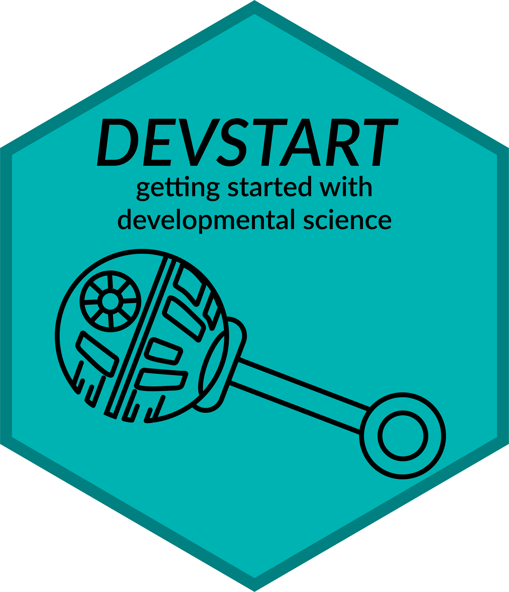

> **⚠️ Warning**  
> This repository began as a fork of the original [DevStart](https://github.com/TommasoGhilardi/DevStart) project.  
> As the scope has grown, we’ve created a dedicated GitHub **organization** to host multiple related projects.  
> Development will now continue **here**.  

# DEVSTART 

**Getting Started with Developmental Cognitive Science**

This is the repository of the DEVSTART  : [DEVSTART](https://devstart.org/) website, a collaborative effort by:
This website comes from the shared effort of: [Francesco](https://www.ru.nl/en/people/poli-f), [Giulia](https://cbcd.bbk.ac.uk/people/students/giulia-serino) and [me](https://tommasoghilardi.github.io)

> [!CAUTION]
> We tried our best to offer the best and most accurate solutions. However, do always check the code and if the outputs make sense. Please get in touch if you spot any errors.
> We apologize in advance for our poor coding skills. Our scripts are not perfect, and they don’t mean to be. But, as Francesco always says, they work! And we hope they will support you during your PhD.
